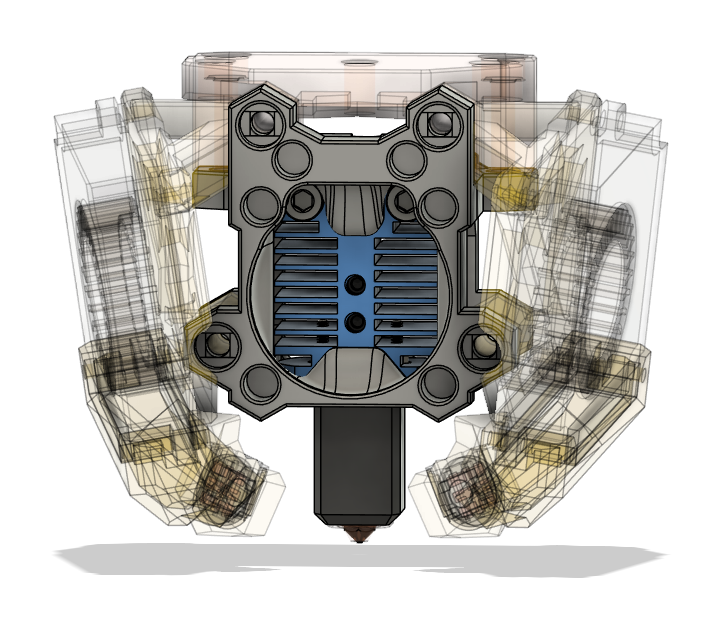
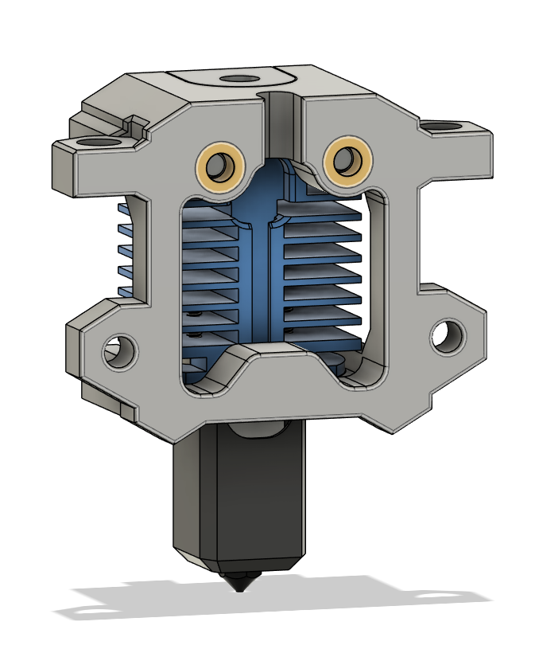
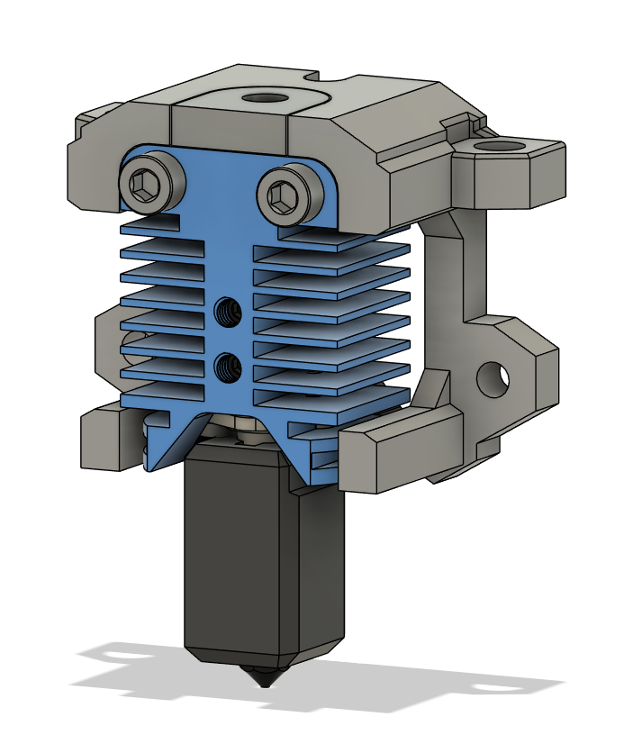
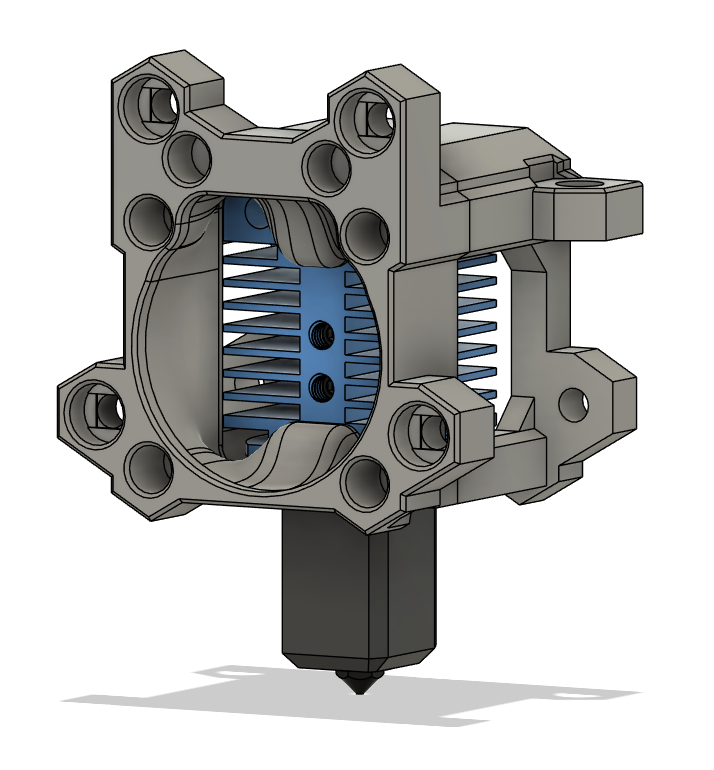

## TZ-E3 1.0 2.0 Hotend mount

### BOM

- 2x M3x22 screws (20mm should work too)
- 2x Voron Heat Insert

### Assembly

There are 2 variations of back part with collet that goes into the hotend from the top.
- Back_No_Collet + Front
- Back + Collet + Front
  

### Steps

1. Remove original hotend collet. 
2. Add heat inserts to the back part

3. Route wires through narrow channel in the back part and secure using M3 screws
   

4. Add front, fan mounts and secure everything as normal

